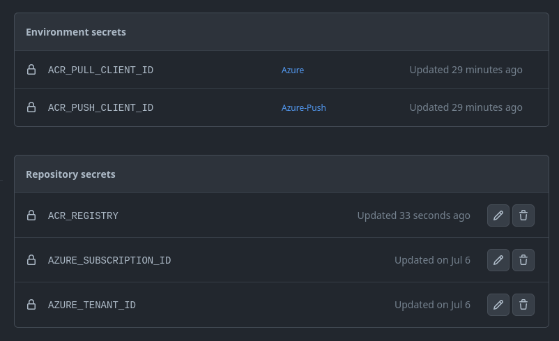

# :gear: 1 - Setting up the Bicep Module Registry

## Description

In this step we're going to set up a [Bicep Module Registry](https://docs.microsoft.com/en-us/azure/azure-resource-manager/bicep/private-module-registry?tabs=azure-powershell), create [service principals](https://docs.microsoft.com/en-us/azure/active-directory/develop/app-objects-and-service-principals) and credentials and add [secrets to our GitHub repo](https://docs.github.com/en/actions/security-guides/encrypted-secrets) such that the actions in the repo can push and pull to our registry.

## Steps

### Pre-requisites

[Login](https://docs.microsoft.com/en-us/powershell/azure/authenticate-azureps?view=azps-8.1.0#sign-in-interactively=) with your Azure account and set the context:

```powershell
Connect-AzAccount
Set-AzContext -SubscriptionName "<subscription name>"
```

### 1. Create an Azure Container Registry instance with Azure Powershell

To host our Bicep Module Registry we're going to set up an [Azure Container Registry](https://docs.microsoft.com/en-us/azure/container-registry/container-registry-intro) in a dedicated resource group.

1. Create a resource group for the Bicep Module Registry

```powershell
# Please use the same name to make it easier to follow this guide
$resourceGroup = New-AzResourceGroup -Name "bicep-registry-demo" -Location "westeurope"
```

2. Create a resource group for the workload we're going to deploy

To have separate lifecycle between our Bicep Module Registry and other workloads we're going to deploy we're going to create a separate resource group for this purpose. This will also allow us to set appropriate role assignments following the least privileged principle.

```powershell
# Please use the same name to make it easier to follow this guide
$workloadResourceGroup = New-AzResourceGroup -Name "bicep-workload-demo" -Location "westeurope"
```

2. Create an Azure Container Registry

> :exclamation: Make note of the registry name you choose. This name must be globally unique.

```powershell
$registryName = "" #example: 'br<your initials><4 digits>'
$registry = New-AzContainerRegistry -Name $registryName -ResourceGroupName "bicep-registry-demo"  -Location "westeurope" -Sku "Basic"
```

3. Add the registry url to the [bicepconfig.json](../bicepconfig.json) in your clone

Find the registry url with:

```powershell
$registry.LoginServer

# <registryname>.azurecr.io
```

Open the file and set the correct registry value:

```json
{
  "moduleAliases": {
    "br": {
      "demoRegistry": {
        "registry": "<your registry url>" // Change this value
      }
    }
  }
}
```

### 3. Set up Azure AD service principals

To use the Bicep Module Registry we're going to set up two service principals. For a demo this might seem overkill, but this is to highlight the usage of apppropriate role assignments (permissions) in Azure.

For the first principal we're going to assign it the [AcrPush](https://docs.microsoft.com/en-us/azure/role-based-access-control/built-in-roles#acrpush) role on the registry. For the other we're going to assign in the [AcrPull](https://docs.microsoft.com/en-us/azure/role-based-access-control/built-in-roles#acrpull) role on the registry, in addition to [Contributor](https://docs.microsoft.com/en-us/azure/role-based-access-control/built-in-roles#contributor) on the workload resource group. The credentials with the push permissions we want to protect (as we only want the main branch to be able to push new modules), while a separate pull credential can allow other branches to safely consume it for deployment.

1. Create service principals and role assignments

```powershell
# Verify your registry
$registry = Get-AzContainerRegistry -Name "$registryName" -ResourceGroupName $resourceGroup.ResourceGroupName

# Set up AcrPush SP
$appPush = New-AzADApplication -DisplayName "bicep-registry-demo-ci-push"
$spPush = New-AzADServicePrincipal -ApplicationId $appPush.AppId
New-AzRoleAssignment -ObjectId $spPush.Id `
  -RoleDefinitionName "AcrPush" `
  -Scope $registry.Id

# Set up AcrPull SP
$appPull = New-AzADApplication -DisplayName "bicep-registry-demo-ci-pull"
$spPull  = New-AzADServicePrincipal -ApplicationId $appPull.AppId
New-AzRoleAssignment -ObjectId $spPull.Id `
  -RoleDefinitionName "AcrPull" `
  -Scope $registry.Id

New-AzRoleAssignment -ObjectId $spPull.Id `
  -RoleDefinitionName Contributor `
  -ResourceGroupName $workloadResourceGroup.ResourceGroupName
```

2. Add Federated Credentials for GitHub

For our Github Actions workflows to be able to login to Azure and push/pull modules we need to set up some credentials. This step adds [federated credentials](https://docs.microsoft.com/en-us/azure/developer/github/connect-from-azure?tabs=azure-powershell%2Clinux#use-the-azure-login-action-with-openid-connect) to use OpenID Connect to authenticate. This remove the need of maintaining (updating and rotating) a client secret in our GitHub repository.

```powershell
#! Set this value to match your own repository!
$githubUser = "matsest"

# Add push credentials (only available to main branch)
New-AzADAppFederatedIdentityCredential -ApplicationObjectId $appPush.Id `
  -Name 'AcrPush' `
  -Audience 'api://AzureADTokenExchange' `
  -Issuer 'https://token.actions.githubusercontent.com' `
  -Subject "repo:$githubUser/bicep-registry-demo:ref:refs/heads/main" `
  -Description "Bicep Module Registry Demo - Push"

# Add pull credentials (available to all branches)
New-AzADAppFederatedIdentityCredential -ApplicationObjectId $appPull.Id `
  -Name 'AcrPull' `
  -Audience 'api://AzureADTokenExchange' `
  -Issuer 'https://token.actions.githubusercontent.com' `
  -Subject "repo:$githubUser/bicep-registry-demo:environment:Azure" `
  -Description "Bicep Module Registry Demo - Pull"
```

3. Add secrets to Github repo

Even though we're not adding client secrets to our GitHub repository we still need to add some repository secrets that tell GitHub Actions which service principal, subscription and tenant to use.

If you have the [GitHub CLI](https://cli.github.com/manual/) installed you can do this step from the command line. If you do not have it you can [add the secrets manually](https://docs.microsoft.com/en-us/azure/developer/github/connect-from-azure?tabs=azure-powershell%2Clinux#create-github-secrets) in the browser.

```powershell
$pushClientId = $appPush.AppId
$pullClientId = $appPull.AppId
$subscriptionId = (Get-AzContext).Subscription.Id
$tenantId = (Get-AzContext).Subscription.TenantId

# Continue if you have GitHub CLI
gh secret set AZURE_TENANT_ID --body "$tenantId"
gh secret set AZURE_SUBSCRIPTION_ID --body "$subscriptionId"
gh secret set ACR_PUSH_CLIENT_ID --body "$pushClientId"
gh secret set ACR_PULL_CLIENT_ID --body "$pullClientId"
```

You should now have the following secrets present:



## Next Step

:heavy_check_mark: You've now successfully:

- [x] Set up a Bicep Module Registry in a dedicated resource group
- [x] Set up a resource group for workload deployments
- [x] Set up dedicated service principals for push and pull to the registry
- [x] Added Federated Identity credentials to authenticate GitHub Actions to Azure
- [x] Added secrets to your GitHub repository

Continue to the [next step](../2-publish/README.md) to publish your first Bicep module!
