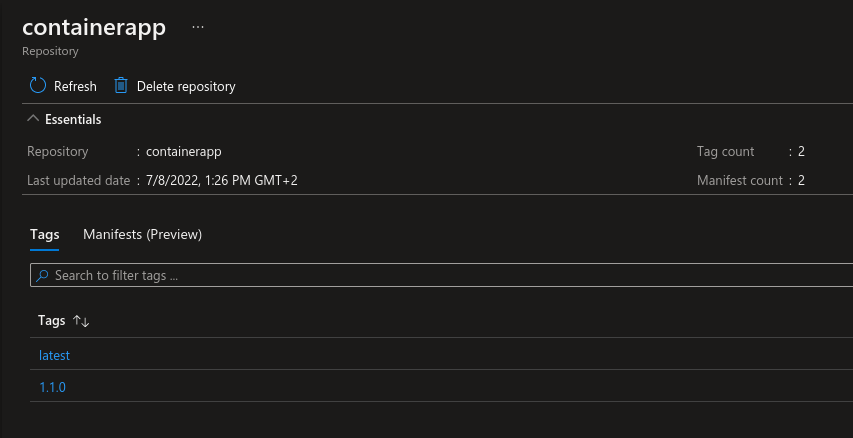

# :arrow_up: 2 - Publishing a module

## Description

After completing [the first part](../1-registry/README.md) we now have a Bicep Module Registry set up. Time to publish some modules!

This part will publish Bicep modules under the [modules path](./modules) to a Bicep registry as defined in [bicepconfig.json](../bicepconfig.json). This is done using a [GitHub Actions workflow](./.github/workflows/bicep-publish.yml) and a [wrapper script](../.github/publish-modules.ps1). The latest git tag will be used as the module version. In addition a 'latest' version of each module will be pushed.

To start of we have two modules:

- storage: a simple [Storage Account](https://docs.microsoft.com/en-us/azure/storage/common/storage-account-overview)
- containerapp: a demo [Azure Container App](https://docs.microsoft.com/en-us/azure/container-apps/overview)

## Steps

Due to the [limited regional availabilty of Azure Container Apps](https://azure.microsoft.com/en-us/global-infrastructure/services/?products=container-apps&regions=all) we want to restrict which regions this module can be used in. As an example we restrict the allowed locations to only those in the European geography.

1. Modify the template in [modules/containerapp/main.bicep](./modules/containerapp/main.bicep).
   - Example: Update the `location` parameter to restrict allowed values

```bicep
@allowed([
  'northeurope'
  'westeurope'
  'germanywestcentral'
  'uksouth'
])
param location string = 'westeurope'
```

2. Commit, tag and push changes

```bash
git add 2-publish/modules/containerapp/main.bicep
git commit -m "fix: set allowed locations"
git tag 1.1.0
git push # push the commit
git push --tags # push the tags
```

This will trigger the [bicep-publish workflow](../.github/workflows/bicep-publish.yml) and publish the module to the registry.

> :exclamation: Note that each new tag pushed will trigger a new published version.

To see the published modules in the registry see [this guide](https://docs.microsoft.com/en-us/azure/azure-resource-manager/bicep/private-module-registry#view-files-in-registry). The module will be listed as a repository in the registry:



## Next Step

:heavy_check_mark: You've now successfully:

- [x] Updated a Bicep template
- [x] Created a new version tag
- [x] Published the module to the Bicep Module Registry

Continue to the next and final step to learn how to [consume this module](../3-consume/README.md) from the registry.
