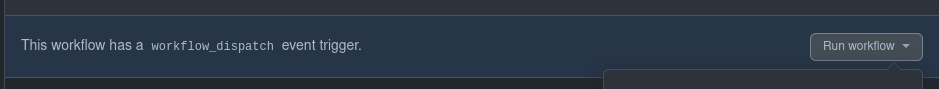
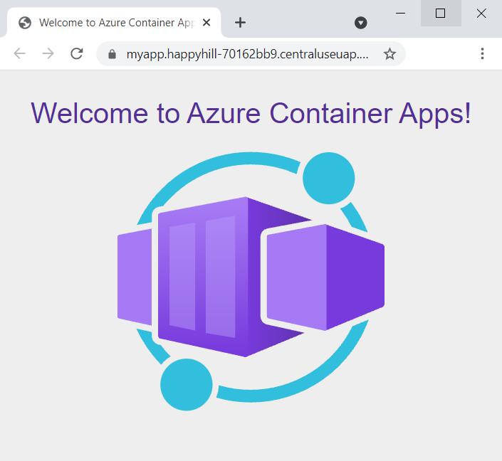

# :arrow_down: 3 - Consuming a module

## Description

After completing [the second part](../2-publish/README.md) we now have a modules published to our Bicep Module Registry. From the [first part](../1-registry/README.md) we also have a dedicated resource group for workload deployments (`bicep-workload-demo`) and a service principal set up with permissions to pull from the registry and deploy to the workload resource group.

This part will consume those modules for a template deployment. The [template we are going to use](./main.bicep) is consuming the [containerapp module](../2-publish/modules/containerapp/main.bicep) from the previous step.

We will trigger a GitHub Actions workflow that deploys the template referring to the published module.

## Steps

### Prerequisites

To enable the relevant resource provider in your subscription run the following:

```powershell
Register-AzResourceProvider -ProviderNameSpace "Microsoft.App"
```

### 1. Deploy from the command line

Note that this module refers to version `1.1.0`. If you have published another version than this, please update the value in [the template](./main.bicep).

1. Deploy the template by running the following command:

```bash
New-AzResourceGroupDeployment -Name "containerapp" -ResourceGroupName "bicep-workload-demo" -TemplateFile "./3-consume/main.bicep"
```

> :warning: This deployment will run with your users' permissions

### 2. Deploy from GitHub Actions

To verify that our GitHub repository and service principal is set up correctly, we're going to trigger the deployment from GitHub Actions.

1. Open you repository in GitHub and select Actions


2. Select the "Bicep Module Consume" action and select the "Run workflow" button.



3. After a few seconds a new run of the workflow will be visible in the list of runs. Open the run and inspect the steps.

4. Expand the last step 'Print Container Apps URL' and inspect the printed URL. Open the URL in your browser to see the deployed container app.



### 3. Bonus: consume a public module

Bicep also offers a [public registry of official modules](https://github.com/Azure/bicep-registry-modules). This is so far pretty limited when it comes to the number of available modules, but to showcase how this can be used as well we can deploy a template consuming one of those modules as well.

To deploy this, add the following to [.github/workflows/bicep-consume.yml](../.github/workflows/bicep-consume.yml):

```yaml
- name: Deploy VNET from Bicep Public Registry
  if: github.event == 'workflow_dispatch' || github.ref_name == 'main'
  id: deploy-vnet
  uses: azure/arm-deploy@v1
  with:
    subscriptionId: ${{ secrets.AZURE_SUBSCRIPTION_ID }}
    resourceGroupName: bicep-workload-demo
    template: 3-consume/bonus.bicep
```

> :warning: Make sure to match the indentation of the other steps in the workflow file.

Push the changes above to the main branch to re-trigger the workflow with this as an additional step.

## Next Step

:heavy_check_mark: **Congratulations!** - you've successfully deployed a Bicep template that refers to a remote module in a private module registry!

See the [learn more section in the main README](../README.md#learn-more) to continue your Bicep learning journey!
