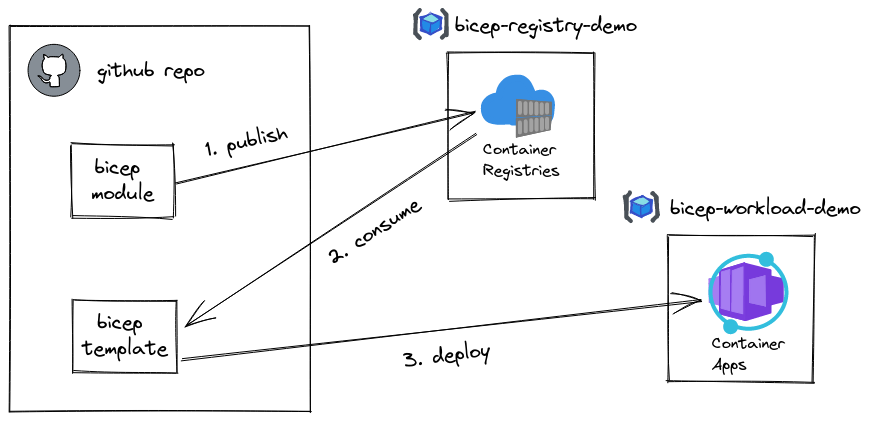

# Bicep Registry Demo

> This demo repository has been overhauled and extensively updated. If you want to see the original version, check out the [`demo-v1` tag](https://github.com/matsest/bicep-registry-demo/tree/demo-v1).

The repo contains a demo to showcase how to work with a private [Bicep Module Registry](https://docs.microsoft.com/en-us/azure/azure-resource-manager/bicep/private-module-registry):

1. :gear: Setting up a private Bicep Module Registry
2. :arrow_up: Publishing a module to a registry
3. :arrow_down: Deploy resources by consuming modules from a private and public registry

For each section there is an accompanying README that adds more details. The steps makes use of [GitHub Actions](https://docs.github.com/en/actions) to push and pull from the registry, as well as for deploying templates.

## Prerequisites

- [PowerShell 7](https://learn.microsoft.com/en-us/powershell/scripting/install/installing-powershell)
- [Azure CLI](https://docs.microsoft.com/en-us/cli/azure/install-azure-cli) (2.42+)
- [Azure PowerShell module](https://docs.microsoft.com/en-us/powershell/azure/install-az-ps) (9.0+)
- Bicep (install with `az bicep install` or upgrade with `az bicep upgrade`) (0.12+)
- An Azure subscription with Owner permissions
- Permission to create service principals in Azure AD

Note: You can also open this repository in VS Code with a [Dev Container](https://docs.github.com/en/codespaces/setting-up-your-project-for-codespaces/introduction-to-dev-containers) to have all tools ready to use.

## Usage

1. Fork this repo
   - click **Fork** in the top-right corner
2. [Clone](https://docs.github.com/en/repositories/creating-and-managing-repositories/cloning-a-repository#cloning-a-repository=) your fork of the repo
   - `git clone <repo url>`
3. Get started with [setting up the registry](./1-registry/README.md)
4. Follow up with [publishing modules to the registry](./2-publish/README.md)
5. Deploy templates that [consume modules from private and public registry](./3-consume/README.md)

## Learn more

- [Bicep overview](https://docs.microsoft.com/en-us/azure/azure-resource-manager/bicep/overview)
- [Bicep modules docs](https://docs.microsoft.com/en-us/azure/azure-resource-manager/bicep/modules)
- [Bicep module registry docs](https://docs.microsoft.com/en-us/azure/azure-resource-manager/bicep/private-module-registry)
- [Bicep on Microsoft Learn](https://docs.microsoft.com/en-us/azure/azure-resource-manager/bicep/learn-bicep)
  - **Recommended**: [Share Bicep modules by using private registries](https://docs.microsoft.com/en-us/learn/modules/share-bicep-modules-using-private-registries/)

## License

[MIT License](./LICENSE)
