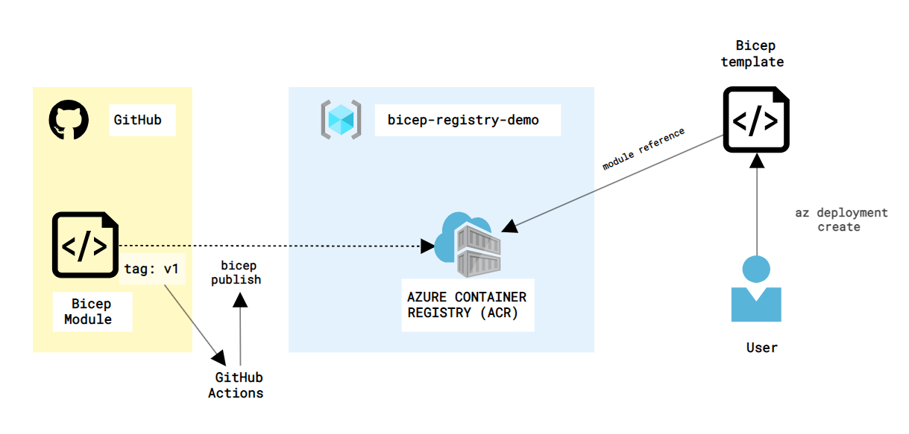

# Bicep Registry Demo

> This demo repository has been overhauled and extensively updated. If you want to see the original version, check out the [`demo-v1` tag](https://github.com/matsest/bicep-registry-demo/tree/demo-v1).

[](https://github.com/matsest/bicep-registry-demo/actions/workflows/bicep-publish.yml)
[](https://github.com/matsest/bicep-registry-demo/actions/workflows/bicep-consume.yml)

The repo contains a demo to showcase how to work with a [Bicep Module Registry](https://docs.microsoft.com/en-us/azure/azure-resource-manager/bicep/private-module-registry) from GitHub:

1. :gear: Setting up a private Bicep Module Registry
2. :arrow_up: Publishing a module to a registry
3. :arrow_down: Consuming modules from a private (and public!) registry

For each section there is an accompanying README that adds more details and steps.

> TODO: update diagram to showcase parts



## Prerequisites

- [Azure CLI](https://docs.microsoft.com/en-us/cli/azure/install-azure-cli) (2.38+)
- [Azure PowerShell](https://docs.microsoft.com/en-us/powershell/azure/install-az-ps) (8.0+)
- Bicep (install with `az bicep install` or upgrade with `az bicep upgrade`) (0.8.2+)
- An Azure subscription with Owner permissions
- Permission to set up an service principal in Azure AD

## Usage

1. Fork the repo
   - Fork this repo by clicking **Fork** in the top-right corner
2. [Clone](https://docs.github.com/en/repositories/creating-and-managing-repositories/cloning-a-repository#cloning-a-repository=) your fork of the repo
   - `git clone <repo url>`
3. [Get started with setting up the registry](./1-registry/README.md)
4. [Publish a module to the registry](./2-publish/README.md)
5. [Consume modules from private and public registry](./3-consume/README.md)

### Cleanup

Delete the resource group and the resources in in by running:

```powershell
# Delete resource groups
Remove-AzResourceGroup -Name "bicep-registry-demo"
Remove-AzResourceGroup -Name "bicep-workload-demo"
```

Delete the service principals:

```powershell
# Delete service principals
Remove-AzAdServicePrincipal -DisplayName "bicep-registry-demo-ci-pull"
Remove-AzADApplication -DisplayName "bicep-registry-demo-ci-pull"

Remove-AzAdServicePrincipal -DisplayName "bicep-registry-demo-ci-push"
Remove-AzADApplication -DisplayName "bicep-registry-demo-ci-push"
```

## Learn more

- [Bicep overview](https://docs.microsoft.com/en-us/azure/azure-resource-manager/bicep/overview)
- [Bicep modules docs](https://docs.microsoft.com/en-us/azure/azure-resource-manager/bicep/modules)
- [Bicep module registry docs](https://docs.microsoft.com/en-us/azure/azure-resource-manager/bicep/private-module-registry)
- [Bicep on Microsoft Learn](https://docs.microsoft.com/en-us/azure/azure-resource-manager/bicep/learn-bicep)
  - **Recommended**: [Share Bicep modules by using private registries](https://docs.microsoft.com/en-us/learn/modules/share-bicep-modules-using-private-registries/)
